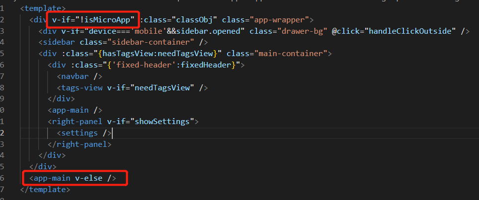

# 微前端子应用实施方案

### 子应用说明

1.配置子应用名称 package.json

```json
{
  "name": "vue-son",  // 必须与基座中配置的子应用名称吻合
  "version": "4.4.0",
  "description": "A magical vue admin. An out-of-box UI solution for enterprise applications. Newest development stack of vue. Lots of awesome features",
  "author": "Pan <panfree23@gmail.com>",
}

```

2.封装子应用打包配置 src/microApp

```javascript
const defaultSettings = require('../../package.json').name

const name = defaultSettings.title || 'Tamil' // page title
const microConfig = {
  // 把子应用打包成 umd 库格式
  library: `${name}-[name]`,
  libraryTarget: 'umd',
  jsonpFunction: `webpackJsonp_${name}`
}
// 解决跨域问题
const headers = {
  // 由于qiankun内部请求都是fetch来请求资源，因此子应用必须容许跨域
  'Access-Control-Allow-Origin': '*'
}
exports = module.exports = { microConfig, headers }
```

注入配置 vue.config.js

```javascript
// 微前端子项目配置注入
const { microConfig, headers } = require('./src/microApp/micro-config.js')
module.exports.devServer.headers = headers// 配置跨域 必须
module.exports.configureWebpack.output = microConfig// umd格式注入 必须module.exports.publicPath = `//localhost:${port}`// 端口号配置 不是必须设置

```

3.封装子应用启动函数 src/tmvc/micro/main-micro.js

```javascript
import Vue from 'vue'
import VueRouter from 'vue-router'
import App from '@/App.vue'
import store from '@/store'
import router from '@/router'
// import Cookies from 'js-cookie'
Vue.use(VueRouter)
/**
 * name 导入官方通信方法
 */
// import appStore from './app-store/app-store'
// 判断是否在微应用试用下
const __qiankun__ = window.__POWERED_BY_QIANKUN__
let instance = null

/**
 * name 导出生命周期函数
 */
const microMain = () => {
  return {
    /**
     * name 微应用初始化
     * param {Object} props 主应用下发的props
     * description  bootstrap 只会在微应用初始化的时候调用一次，下次微应用重新进入时会直接调用 mount 钩子，不会再重复触发
     * description 通常我们可以在这里做一些全局变量的初始化，比如不会在 unmount 阶段被销毁的应用级别的缓存等
     */
    async bootstrap(props = {}) {
      // 存储全局使用 props是基座传输过来的值，可进行token等存储使用
      Vue.prototype.$MicroBootstrap = props
      // Cookies.set(props,'$MicroBootstrap')
    },
    /**
     * name 实例化微应用
     * param {Object} props 主应用下发的props
     * description 应用每次进入都会调用 mount 方法，通常我们在这里触发应用的渲染方法
     */
    async mount(props) {
      // 注册应用间通信  props是基座传输过来的值，可进行token等存储使用
      // appStore(props)// 存储例子1 可作参考
      Vue.prototype.$MicroMount = props
      // Cookies.set(props,'$MicroMount')
      // 注册微应用实例化函数
      render(props)
    },
    /**
     * name 微应用卸载/切出
     */
    async unmount() {
      instance.$destroy()
      instance.$el.innerHTML = ''
      instance = null
    },
    /**
     * name 手动加载微应用触发的生命周期
     * param {Object} props 主应用下发的props
     * description 可选生命周期钩子，仅使用 loadMicroApp 方式手动加载微应用时生效
     */
    async update(props) {
      console.log('update props', props)
    }
  }
}

/**
 * name 子应用实例化函数
 * param {Object} props param0 qiankun将用户添加信息和自带信息整合，通过props传给子应用
 * description {Array} routes 主应用请求获取注册表后，从服务端拿到路由数据
 * description {String} 子应用路由前缀 主应用请求获取注册表后，从服务端拿到路由数据
 */
const render = ({ name, container } = {}) => {
  console.log(name,container)
  Vue.config.productionTip = false

  instance = new Vue({
    router,
    store,
    render: h => h(App)
  }).$mount(container ? container.querySelector('#app') : '#app')
}

// 独立运行环境直接实例化vue
__qiankun__ || render()
export { microMain, render }

```

注入启动函数 src/main.js 原有的vue初始化函数可以删除了

```javascript
// 微前端配置文件注入
import tmvc from '@/tmvc'
// name 导出微应用生命周期
const { bootstrap, mount, unmount } = tmvc.microMain()
export { bootstrap, mount, unmount }

```

4.修改子应用layout组件 src/layout/index.vue 如果是微前端模式下，隐藏菜单和头部



5.修改子应用路由配置 src/router/index.js

如果是微前端模式，不需要匹配*重定向404，因为基座中已经有相关配置了

```javascript
const notFindRoute = window.__POWERED_BY_QIANKUN__ ? [] : [{ path: '*', redirect: '/404', hidden: true }]
```

如果微前端模式下，所有一级路由要添加路由前缀，与基座中配置的activeRule要吻合

```javascript
// 判断是否在微应用试用下
const __qiankun__ = window.__POWERED_BY_QIANKUN__

let prefix = '';
if(__qiankun__){
  prefix = '/vue-son' // /vue-son为主应用的activeRule
}

const createRouter = () => new Router({
  // mode: 'history', // require service support
  scrollBehavior: () => ({ y: 0 }),
  routes: constantRoutes.map(e=>{
    // 如果是子应用模式，添加前缀
    if (__qiankun__) {
      e.path = prefix + e.path
    }
    return e
  })
})
```

6.封装应用通讯 src/microApp/app-store/app-store.js

```javascript
import store from '@/store'
// import { DataType } from "wl-core"

/**
 * @name 声明一个常量准备将props内的部分内容储存起来
 */
const STORE = {}

/**
 * @name 启动qiankun应用间通信机制
 * @param {Object} props 官方通信函数
 * @description 注意：主应用是从qiankun中导出的initGlobalState方法，
 * @description 注意：子应用是附加在props上的onGlobalStateChange, setGlobalState方法（只用主应用注册了通信才会有）
 */
const appStore = props => {
  console.log(props)
  /**
   * @name 监听应用间通信，并存入store
   */
  props?.onGlobalStateChange?.(
    (value, prev) => {
      console.log(props.name, value, prev)
      store.dispatch('appstore/setMsg', 'name为---' + props.name)
    },
    true
  )
  // /**
  //  * @name 改变并全局广播新消息
  //  */
  console.log(props)
  props.setGlobalState({
    ignore: props.aa,
    msg: props.aa
  })

  /**
   * @name 将你需要的数据存起来，供下面setState方法使用
   */
  STORE.setGlobalState = props?.setGlobalState
  STORE.name = props.name
}

/**
 * @name 全局setState方法，修改的内容将通知所有微应用
 * @param {Object} data 按照你设定的内容格式数据
 */
const setState = (data) => {
  // if (!DataType.isObject(data)) {
  //   throw Error('data必须是对象格式');
  // }
  alert(data)
  STORE.setGlobalState?.({
    ignore: STORE.name,
    ...data
  })
}

export {
  setState
}
export default appStore

```

引入通讯函数

```javascript
import appStore from './app-store/app-store'
 
// src/tmvc/micro/main-micro.js
 
async mount(props) {
 // 注册应用间通信  props是基座传输过来的值，可进行token等存储使用
 appStore(props)// 存储例子1 可作参考 挂载应用通讯
 Vue.prototype.$MicroMount = props
 // Cookies.set(props,'$MicroMount')
 // 注册微应用实例化函数
 render(props)
},
```
